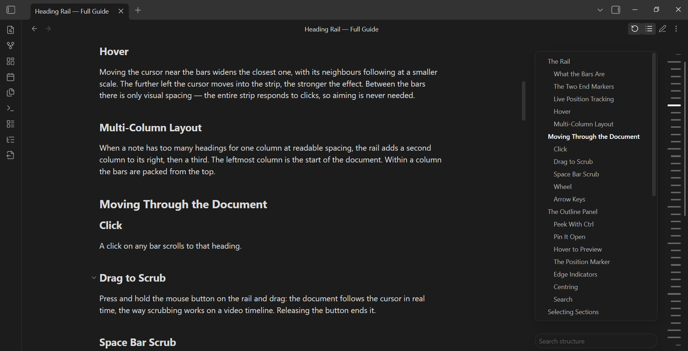
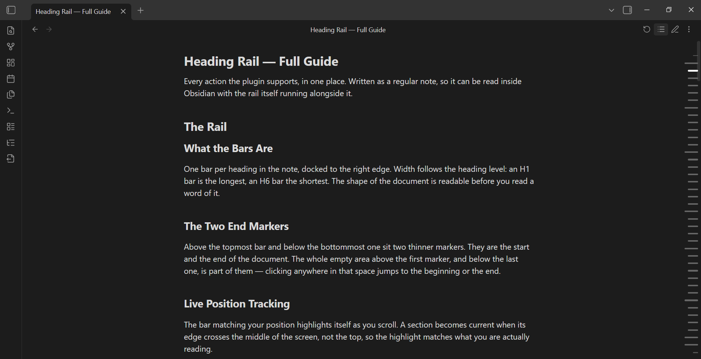
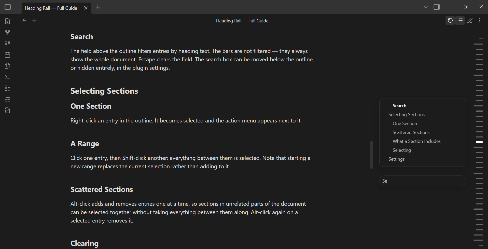
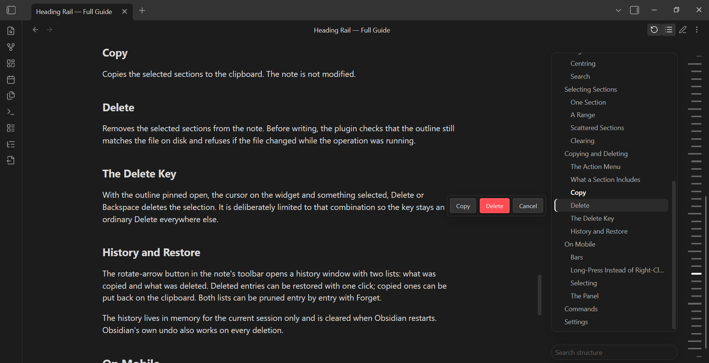
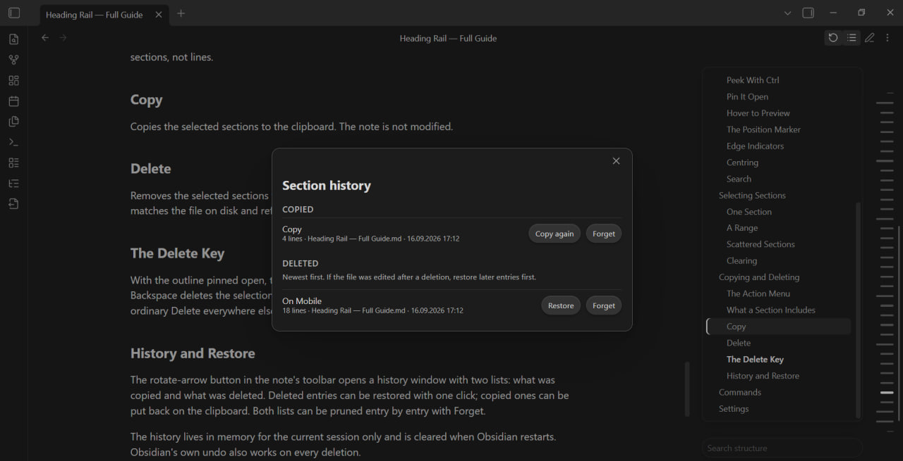
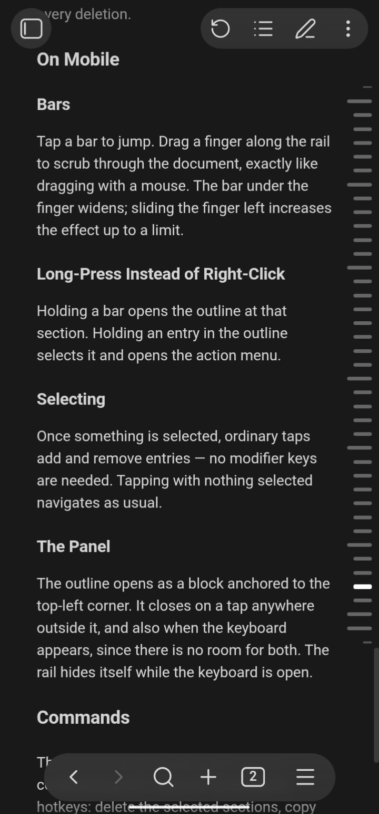
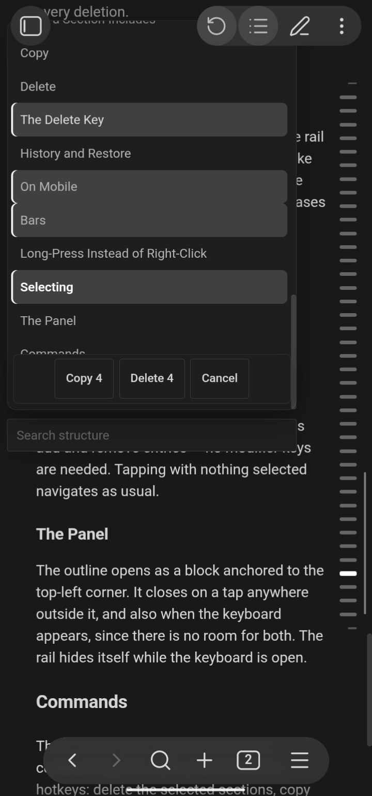
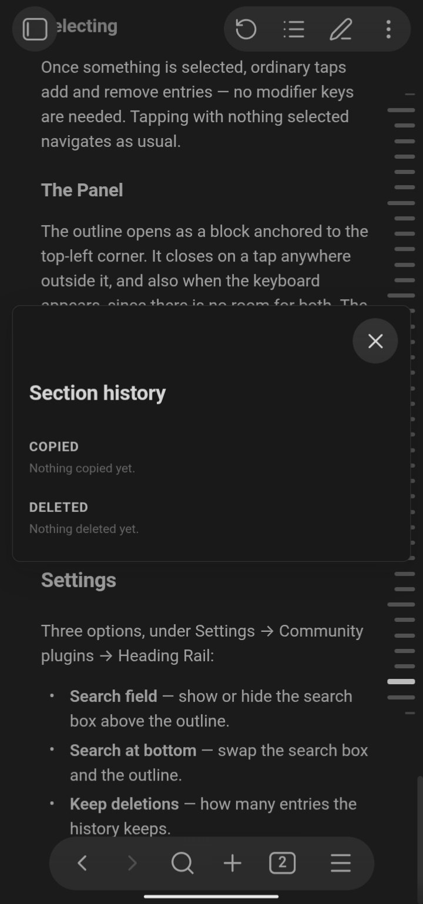

# Heading Rail

A table of contents, outline, and heading navigation plugin for Obsidian — heading bars docked to the right edge of the note instead of a flat list, with live position tracking, in-panel search, drag-to-scroll, and section-level copy and delete. Built for people who use headings a lot: long notes, structured documentation, anything where jumping around by section matters more than reading top to bottom.

*[Русский](#русский) · [Deutsch](#deutsch)*



## Why Heading Rail

Most table-of-contents and outline plugins for Obsidian show a static list of headings: click one, jump to it, that's the whole interaction. Heading Rail treats the outline as a live, working view of the document rather than a lookup list. The current position tracks itself while you scroll, the panel has its own search, dragging along the rail scrolls the note in real time the way scrubbing works on a video timeline, and sections can be selected, copied, or deleted directly from the outline with a history to restore from if you change your mind. Mobile gets the same depth of interaction as desktop — touch and long-press instead of hover and right-click — rather than a stripped-down companion mode.

## At a glance

| Capability | Heading Rail |
|---|---|
| Live position tracking while scrolling | Yes |
| Search within the outline | Yes |
| Drag-to-scroll (scrubbing) with mouse, space bar, or touch | Yes |
| Faster wheel-scroll over the rail | Yes |
| Multi-column layout on very long notes | Yes |
| Multi-select — range and individually scattered sections | Yes |
| Copy or delete sections straight from the outline | Yes |
| History with one-click restore for deletions | Yes |
| Works fully on mobile (Android and iOS) | Yes |
| Colours follow the active theme | Yes |
| Requires an external service or account | No |

## Features

### Navigation

- **Live position tracking** — the active bar highlights itself while you scroll. No hovering needed.
- **Dock-style hover** — the bar under the cursor widens and its neighbours follow, so the target is easy to hit.
- **No dead zones** — the whole strip is clickable, only the spacing between bars is visual.
- **Multi-column layout** — on very long notes the bars split into additional columns instead of shrinking into a solid line.

### Moving through a document

- **Drag to scrub** — hold the mouse button, or the space bar, and drag along the rail to scroll the document in real time.
- **Faster wheel scrolling** — scrolling over the rail moves the document several times faster than scrolling over the text.

### The outline panel

- **Peek and pin** — hold Ctrl to see the outline temporarily, right-click a bar (or use the toolbar button) to pin it open at that section.
- **Search** — a field above the outline filters the list by heading text without touching the bars themselves.
- **Follows the document** — scrolling the note keeps the outline centred on the current section automatically.

### Managing sections

- **Selection** — click to select one, Shift-click for a range, Alt-click to add or remove scattered entries.
- **Copy and delete** — a small menu next to a selected entry acts on the whole selection, including everything nested under each heading.
- **History** — deleted sections go into a session history with one-click restore; copied sections can be put back on the clipboard the same way.

### Mobile

- Drag a finger along the rail to scrub, exactly like dragging with a mouse.
- Long-press instead of right-clicking to open the section menu or pin the outline.
- The outline opens as a panel anchored to the corner instead of floating beside the rail.

### Appearance

- Every colour comes from Obsidian's own theme variables, so the plugin matches whatever theme is active — light, dark, or a custom one — without separate configuration.

## Screenshots

### Desktop






### Mobile





## Usage

| Action | Desktop | Mobile |
|---|---|---|
| Jump to a section | Click a bar | Tap a bar |
| Scrub through the document | Hold and drag, or hold Space and move | Drag a finger along the rail |
| Peek at the outline | Hold Ctrl | — |
| Pin the outline open | Right-click a bar, or the toolbar button | Long-press a bar, or the toolbar button |
| Step between headings | Arrow keys while hovering the rail with the outline open, or Ctrl + arrows from anywhere | — |
| Select sections | Shift-click for a range, Alt-click to toggle | Long-press, then tap to add or remove |
| Copy or delete a selection | Right-click a selected item | Long-press a selected item |
| Restore a deletion | History button in the note toolbar | Same |

A full walkthrough of every action, written as a regular note, is in [GUIDE.md](GUIDE.md).

## Install

The easiest way: open the plugin's page on [Obsidian's community site](https://obsidian.md/plugins?id=heading-rail) and use the **Add to Obsidian** button, or search for "Heading Rail" under Settings → Community plugins → Browse once it appears in the in-app index.

Manual install also works, and is useful while the search index is still catching up:

1. Download `manifest.json`, `main.js` and `styles.css` from the latest [release](../../releases).
2. Put them in `<vault>/.obsidian/plugins/heading-rail/`.
3. Restart Obsidian, turn off Restricted mode, enable **Heading Rail** under Settings → Community plugins.

## A note on deletion

This plugin can delete sections from your notes. Before every deletion it verifies that the outline still matches the file on disk, and it refuses to write if the file changed while the operation was running. Deletions go into an in-session history with one-click restore, and Obsidian's own undo still works. Even so — this is the one feature that modifies your files, so treat it accordingly.

## Development

Plain JavaScript, no bundler. `core.js` holds the logic, `styles.css` the appearance; `build.py` assembles `main.js` from both and inlines a fallback copy of the CSS so the plugin still renders if `styles.css` fails to load.

```
python3 build.py
```

Edit `core.js` and `styles.css` — never `main.js`, it is generated.

## License

MIT — see [LICENSE](LICENSE).

---

## Русский

Плагин-навигатор по заголовкам и оглавление для Obsidian — полоски у правого края заметки вместо плоского списка, с отслеживанием текущей позиции, поиском внутри панели, протяжкой мышью и удалением или копированием разделов прямо из структуры.

**Чем отличается от обычного оглавления.** Большинство таких плагинов показывают статичный список: кликнул — перешёл, и всё. Здесь структура — рабочий, живой вид документа: активный раздел подсвечивается сам при прокрутке, у панели есть свой поиск, протяжка вдоль полосок крутит документ в реальном времени, а выбранные разделы можно скопировать или удалить прямо из структуры, с историей для отката. На телефоне то же самое взаимодействие, что на компьютере — касание и удержание вместо наведения и правой кнопки, а не урезанная версия.

**Основное:** отслеживание текущего раздела без наведения; эффект дока при наведении; попадание без мёртвых зон; протяжка мышью, пробелом или пальцем; ускоренная прокрутка колесом; раскладка в несколько столбцов на длинных заметках; раскрываемая структура с поиском; множественное выделение с копированием и удалением, с историей и восстановлением; полноценная работа на телефоне; следование текущей теме без отдельных настроек.

**Установка:** проще всего — через страницу плагина на сайте Obsidian, кнопка «Add to Obsidian», либо поиском «Heading Rail» в Settings → Community plugins → Browse, как только он появится во внутреннем поиске. Вручную тоже работает: скачайте `manifest.json`, `main.js` и `styles.css` из последнего релиза, положите в `<хранилище>/.obsidian/plugins/heading-rail/`, перезапустите Obsidian и включите плагин в том же разделе. Подробная инструкция по каждому действию — в [GUIDE.md](GUIDE.md).

**Про удаление:** плагин умеет удалять разделы из заметок. Перед каждым удалением он сверяет структуру с файлом на диске и отказывается писать, если файл изменился во время операции. Удалённое попадает в историю с восстановлением в одно нажатие, обычная отмена Obsidian тоже работает.

---

## Deutsch

Ein Inhaltsverzeichnis- und Gliederungs-Plugin für Obsidian — Überschriften-Balken am rechten Rand der Notiz statt einer flachen Liste, mit Positionsverfolgung, Suche innerhalb der Gliederung, Ziehen zum Scrollen und Abschnitte kopieren oder löschen direkt aus der Gliederung.

**Der Unterschied zu einem gewöhnlichen Inhaltsverzeichnis.** Die meisten solchen Plugins zeigen nur eine statische Liste: anklicken, springen, fertig. Hier ist die Gliederung eine lebendige Arbeitsansicht des Dokuments: Der aktive Abschnitt hebt sich beim Scrollen von selbst hervor, das Panel hat eine eigene Suche, Ziehen entlang der Leiste scrollt die Notiz in Echtzeit, und ausgewählte Abschnitte lassen sich direkt aus der Gliederung kopieren oder löschen, mit Verlauf zum Wiederherstellen. Auf dem Smartphone die gleiche Interaktionstiefe wie am Computer — Tippen und langes Drücken statt Hovern und Rechtsklick, kein reduzierter Begleitmodus.

**Funktionen:** Verfolgung der aktuellen Position ohne Hovern; Dock-Effekt beim Hovern; keine toten Klickzonen; Ziehen mit Maus, Leertaste oder Finger; schnelleres Scrollen mit dem Mausrad; mehrspaltige Anordnung bei sehr langen Notizen; ausklappbare Gliederung mit Suche; Mehrfachauswahl mit Kopieren und Löschen, mit Verlauf und Wiederherstellung; volle Unterstützung auf Mobilgeräten; folgt automatisch dem aktiven Theme.

**Installation:** Am einfachsten über die Plugin-Seite auf der Obsidian-Website mit der Schaltfläche „Add to Obsidian“, oder über die Suche nach „Heading Rail“ unter Settings → Community plugins → Browse, sobald es dort erscheint. Manuell geht es ebenso: `manifest.json`, `main.js` und `styles.css` aus dem neuesten Release herunterladen, nach `<Vault>/.obsidian/plugins/heading-rail/` kopieren, Obsidian neu starten und das Plugin im selben Menü aktivieren. Eine ausführliche Anleitung zu jeder Funktion steht in [GUIDE.md](GUIDE.md).

**Hinweis zum Löschen:** Das Plugin kann Abschnitte aus Notizen löschen. Vor jedem Löschvorgang wird geprüft, ob die Gliederung noch zur Datei auf der Festplatte passt; bei Änderungen während des Vorgangs wird nicht geschrieben. Gelöschtes landet in einem Verlauf mit Wiederherstellung per Klick, und das normale Rückgängigmachen von Obsidian funktioniert weiterhin.
